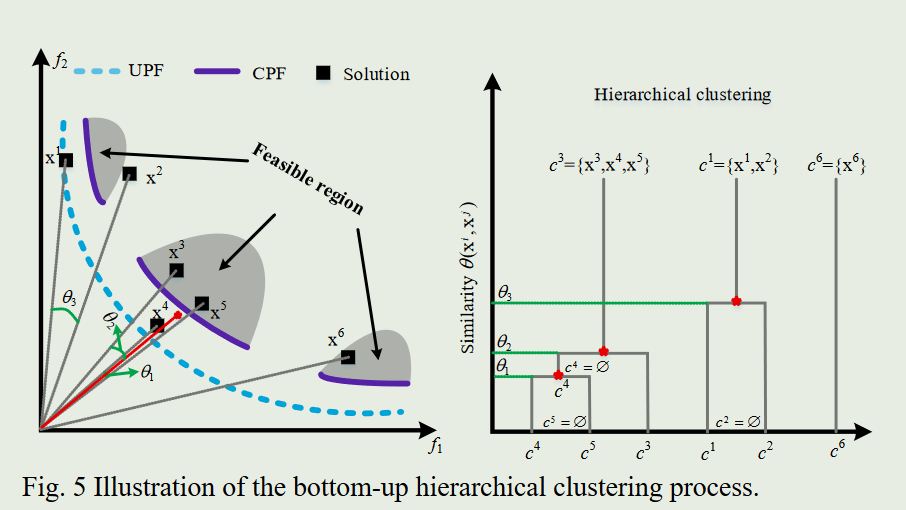

# Learning-Aided Evolutionary Search and Selection for Scaling-up Constrained Multiobjective Optimization代码复现

用于扩展约束多目标优化的学习辅助进化搜索和选择 代码复现

---

# introduce
**Author:** Z.R.Wang

**Email:** [wangzhanran@stumail.ysu.edu.cn](mailto:wangzhanran@stumail.ysu.edu.cn)

**Affiliation:** YSU 908智能动力系统研究组

# **LCMOEA 学习辅助的约束多目标进化算法**

现有的**约束多目标进化算法**（CMOEA）在**复杂约束多目标优化问题**（CMOP）上***平衡*种群收敛性、多样性和可行性**方面仍有很大的改进空间。此外，当面对**扩大目标空间或搜索空间**的 CMOP 时，它们的**有效性会急剧恶化**。

因此，我们需要设计一个**学习辅助的 CMOEA**，它具有针对各种 CMOP 的有前景的问题解决能力和可扩展性。

在所提出的求解器中，分别在忽**略约束的任务**和**可行性优先任务**上在线训练**两**个学习模型，然后使用它们来**学习两个基于改进的向量**，并通过**差分进化**增强搜索。

此外，**父解和子解的并集群体**被基于**余弦相似度**的**分层聚类**划分为多个子集。

开发一个**综合指标**，考虑解的**目标的性能**和**约束违反程度**，以**从每个集群中选择代表性的解**。通过求解具有各种**不规则帕累托前沿**、**目标数量范围从 2 到 15 **以及**搜索空间维度扩展到 1000 **的 CMOP，验证了所提出的优化器的有效性。

## CMOEA

一般来说，CMOEA 的流程可以如图 1 所示。给定一个目标 CMOP，它从初始父群体开始。一般来说，CMOEA 的流程可以如图 1 所示。给定一个目标 CMOP，它从初始父群体开始。从初始父代种群 P 开始。然后，通过将 P 输入到繁殖模型中，使用交叉和变异等进化算子进行搜索，生成后代种群 Q。随后，P 和 Q 在环境选择模型中进行评估。该模型评估解的质量，通过保留 P 和 Q 组合中解的前50%部分来更新 P。这个迭代过程类似于 MOEA，一直持续到满足指定的终止条件为止。 CMOEA的显着特点在于它要求目标问题符合一组约束条件，因此需要设计相应的CHT来应对违反约束条件带来的挑战。与 MOEA 相比，CMOEA 的目标是获得有前途的种群，在收敛性、多样性和逼近 CPF 的可行性之间取得平衡。接下来，我们将根据现有的 CMOEA 使用的 CHT 对其进行简要回顾。然后，我们分析了图 1 所示的六个 CPF 案例中满足约束条件所带来的各种挑战。最后，我们将阐明这项工作的动机。

## LCMOEA 总体框架

  

算法 1 描绘了 LCMOEA 的核心框架，反映了传统 MOEA 中常见的结构，如图 1 所示。针对具有 **m 个目标**和 **n 个变量**的 CMOP目标 进行量身定制，它从第 1 行中的初始群体 P 开始，由 N 组随机抽样的解组成。主循环封装了从第 2 行到第 7 行的过程，体现了迭代进化过程。在此循环中，它首先在第3行中获取**两个经过训练的模型 M1 和 M2**，它们用于**复制**以帮助进化搜索。在这里，M1 和 M2 都设计为多层感知器 (**MLP**)，共享一致的架构。它们的**输入/输出层有 n 个神经元**，并且**只有一个包含 K 个神经元的隐藏层**被认为使模型*训练的成本可承受且值得收益*（K=10） 

如图3所示，M1和M2的训练数据分别涉及根据**忽略约束的任务**和**可行性优先任务**来自P的配对解。有关模型训练的更多细节将在后续小节中详细阐述。**在M1和M2的支持下**，LCMOEA通过**对P的学习辅助**搜索在第4行**生成后代种群Q**，这可以加速种群向CPF的进展。

采用**聚类辅助**和**涉及约束的环境选择**，从 P+Q 中过滤掉一半适应性较差的解，以获得第 5 行中的新 P。上述训练、搜索和选择过程不断迭代，直到满足终止条件，即$ FE = FE_{max}$。这里，$FE$是函数评估的计数器，$FE_{max}$是预先分配的函数评估的最大值。最终 P 表示目标 CMOP 的 CPF 近似值，在第 8 行中输出。

## Learning-aided Reproduction 学习辅助的繁衍

繁衍的目的是在搜索空间中生成具有更高质量的新解。在本文中，我们提出了一种**可学习差分进化（LDE）算子**，它**利用两个 MLP 模型（即 M1 和 M2）来搜索新的解**，如图 3 所示。

  

具体来说，对于每个父解决方案$\mathrm{x}\in P,$， LDE 可以通过以下搜索公式生成子解

$$
\mathrm{x}^c=\mathrm{x}+\alpha(y^1-\mathrm{x})+\\(0.5-\alpha)(y^2-\mathrm{x})+r(\mathrm{x}^1-\mathrm{x}^2)
$$

其中$y^1$和$y^2$为分别是 M1 和 M2 以x为输入的输出。另外, $x^1$和$x^2$是从P中选择的两个随机解，$x\neq x^1\neq x^2$。此外，参数$\alpha \in[0, 0.5]$用于控制LDE搜索，r是在\[0, 1]内采样的随机值。从公式可以看出，LDE的独特之处在于它使用两个MLP模型来学习两个向量y1和y2来指导进化搜索。具体来说，式中的LDE由三项组成，每一项都有不同的目的：

第一项促进向UPF的快速收敛

第二项加速向CPF的收敛

最后一项增强搜索多样性以防止群体陷入局部最优

我们将在第四节中对上式进行深入的实验分析，包括参数α的敏感性分析和（y1，y2，x1，x2）的有效性分析。接下来，我们将通过了解为什么以及如何学习两个向量 y1 和 y2 以达到特定目的来进一步解释 LDE 的优点。

### 对 MLP 模型的期望

传统进化算子（例如差分进化）的搜索方向通常是随机的。当搜索空间变大且受到约束时，这种盲目搜索将使其效率急剧下降。常见的应对策略是**根据历史最优解来引导搜索**。然而，这种搜索行为很容易导致**局部最优**或**种群过早收敛**。其背后的主要原因是，一旦这些指导解陷入局部最优，其进一步改进的潜力就会受到极大阻碍。我们的动机源于这样的信念：每个**解**，即使是那些已经被确定为**最佳的解**，都应该具备**在其特定位置学习有希望的改进方向**的能力。为了解决这个问题，我们建议训练两个 MLP 模型（M1 和 M2）来实现这一目的。

M1的目标是学习**忽略约束任务**的解的改进原理。该模型旨在**以更快的速度将种群推向UPF**，引导搜索朝着**基于目标的性能改进方向发展**。

M2旨在学习**可行性优先任务**的改进原则。该模型的目标是通过**寻找可行性改进**的方向，快速引导**种群推向CPF**。

因此，使用 MLP 模型可以进行更明智、更有针对性的搜索。这些模型不是仅仅依赖于历史最优解，而是为每个解（包括发现的最佳性能解）提供了在其特定位置学习有希望的改进方向的能力。每个解都成为改进过程的积极贡献者。解能够根据其个体特征来调整和指导搜索。这种适应性对于避免停滞、局部最优或过早收敛（CMOEA 中的常见挑战）至关重要。

### MLP模型的训练

训练是通过**梯度下降**的**反向传播**迭代更新M1和M2权重的过程。它涉及通过沿着最陡下降方向调整参数来计算和最小化损失。 MLP模型的详细训练过程请参见附录。给定一个**数据集$D=\{(\mathrm{x}_i,\vec{\mathrm{x}}_i)\}_{i=1}^N$和 N 个配对的输入标签**示例，训练的目标是**更新权重**，以便模型的输出$y_i$足够接近标签$x_i$每个输入$x_i$, i = 1, ..., N。在这项工作中，**均方误差 (MSE) 用作要最小化的损失$L_x$以进行评估**。我们利用为特定下游任务定制的数据集训练两个不同的 MLP 模型M1 和 M2。这些模型配备了不同的权重，以增强其适应性。为了有效解决与约束和扩大搜索空间相关的挑战，我们精心准备了 M1 和 M2 的**训练数据**，将它们定制为两个不同的优化任务。

算法 2 展示了详细的训练过程，从两个随机 MLP 模型开始。为了确保**泛化能力**，我们首先使用一组 N 个均匀分布的参考向量创建 N 个不同的标量化子问题，即$V=(\nu_1,...,\nu_N)$。（**个人感觉：**这里是对m个目标函数求单位向量，比如两个目标$f_1$,$f_2$，求$af_1+(1-a)f_2$这个加权目标函数所对应的斜线，创建N个这样的子问题）对于每个$v\in V$，通过对每个$x \in P$计算$\theta(x,v)$可以找到最接近 v 的两个不同解$(x^1,x^2) \in P$。这里$\theta(x,v)$表示 x 和 v 之间的锐角，可以计算为：

$$
\theta(\mathrm{x},\nu)=\arccos\left|\frac{\mathrm{F'(x)}\times\nu}{\left\|\mathrm{F'(x)}\right\|\times\left\|\nu\right\|}\right|
$$

其中$\mathrm{F'(x)}=(f_1^{\prime}(\mathrm{x}),...,f_m^{\prime}(\mathrm{x}))$ 是x的归一化向量，$f_i^{\prime}(\mathbf{x})$计算如下：

$$
f_i'(\mathbf{x})=\frac{f_i(\mathbf{x})-z_i^{\min}}{z_i^{\max}-z_i^{\min}},i=1,2,...,m
$$

其中$z_i^{\max}$和$z_i^{\min}$是 P 中所有解的第 i 个目标的最小值和最大值。 ，我们只需要确定 x1 和 x2 中哪个是输入，哪个是标签。

对于忽略约束任务的 M1，我们从 (x1, x2) 获取输入 x 及其标签$\vec{\mathbf{x}}$，如下所示：

$$
\begin{cases}\mathrm{x=}[fit(\mathrm{x}^1,\nu)\geq fit(\mathrm{x}^2,\nu)]? \mathrm{x}^1:\mathrm{x}^2\\\mathrm{\vec{x}=}[fit(\mathrm{x}^1,\nu)<fit(\mathrm{x}^2,\nu)]? \mathrm{x}^1:\mathrm{x}^2\end{cases}
$$

其中$fit(\mathrm{x},\nu)$表示 x 在求解参考向量 v 对应的子问题时的基于目标的性能，其中可以计算如下

$$
fit(\mathrm{x})=\sum_{i=1}^m\nu_if_i(\mathrm{x})
$$

对于可行性优先任务上的 M2，我们首先得到输入 x 及其标签$\vec{\mathbf{x}}$，如下所示，

$$
\begin{cases}\mathrm{x=}[c\nu(\mathrm{x}^1){>}c\nu(\mathrm{x}^2)]? \mathrm{x}^1{:}\mathrm{x}^2\\\mathrm{\vec{x}=}[c\nu(\mathrm{x}^1){<}c\nu(\mathrm{x}^2)]? \mathrm{x}^1{:}\mathrm{x}^2\end{cases}
$$

如果$c\nu(\mathrm{x}^1)=c\nu(\mathrm{x}^2)$，我们可以根据(10)进一步确认输入x及其标签$\vec{\mathbf{x}}$。这样，我们就可以根据x和它的标签$\vec{\mathbf{x}}$计算M1（M2相同）的损失Lx，然后通过梯度下降的反向传播（记为$\partial L_\mathrm{x}/\partial\mathrm{~w}_1$）更新其权重（记为$w_1$） ）。值得指出的是，训练过程中只涉及每个解的归一化变量向量。具体来说，x 的第 i 个变量$x_i$标准化如下：

$$
x_i'=\frac{x_i-lb_i}{ub_i-lb_i},i=1,2,...,n
$$

其中 ub  和 lb 是对应的 n 维变量空间的上下界。我们使用上面获得的 N 个输入标签对作为数据集来训练 M1 和 M2 10轮。最后，输出训练好的两个模型以帮助（7）中的进化搜索。为了简化理解，为这两个任务准备训练数据的过程如图 4 所示。

使用均匀分布的参考向量将 CMOP 划分为子问题。然后，分别考虑基于目标的性能和 CV 程度，为 M1 和 M2 的每个子问题创建训练数据，以最大化模型泛化。然而，M1 和 M2 训练数据可能会出现冲突，特别是在处理完全分离的 UPF 和 CPF 时，如图 4 的解决方案配对所示。因此，(7)中的参数α在平衡LDE进化搜索过程中这些模型引入的冲突中起着至关重要的作用。总体策略是引导种群最初迅速走向 UPF，并在特定的进化阶段将其转向 CPF，并相应调整参数 α 以与这一见解保持一致。

### 可学习再生产的整体过程

算法 3 展示了所提出的可学习繁殖通过 LDE 获得后代种群 Q 的整个过程，这需要三个输入：经过训练的 M1、M2 和 P。

首先，在第 1 行中，Q 被初始化为空集然后，通过保存N个新的子解，在主循环中进行更新，包括从第2行到第9行的过程。具体来说，

第 2 行中，对于的每个 $x\in P$，可以通过将 x 分别输入到经过训练的 M1 和 M2 来计算两个引导向量 $y^1$ 和 $y^2$。然后，从 P 中随机选择另外两个不同的解 $x^{d_1}$ 和 $x^{d_2}$ 。之后，运行 LDE 以重现新的子解 $x^c$， 可以通过以下搜索公式生成子解

$$
\mathrm{x}^c=\mathrm{x}+\alpha(y^1-\mathrm{x})+\\(0.5-\alpha)(y^2-\mathrm{x})+r(\mathrm{x}^1-\mathrm{x}^2)
$$

其中$y^1$和$y^2$为分别是 M1 和 M2 以x为输入的输出。另外, $x^1$和$x^2$是从P中选择的两个随机解，$x\neq x^1\neq x^2$。此外，参数$\alpha \in[0, 0.5]$用于控制LDE搜索，r是在\[0, 1]内采样的随机值。

$$
\begin{cases}\alpha=0.5&if&FE\leq0.5FE_{\max}\\\alpha=0.0&if&FE>0.5FE_{\max}\end{cases}
$$

该设置类似于一个两阶段过程：初始阶段集中于 UPF 附近的探索，而后续阶段则集中于 CPF 附近的探索。

然后使用加法运算符更新Q。请注意，在再现中也使用了多项式变异来更新xc，以进一步避免局部最优的陷阱。

最后，在第10行输出获得的具有N个子解的Q。这种可学习再现的计算复杂度主要由训练和搜索过程决定。具体来说，MLP模型的训练时间复杂度为O(NEnK)，其中N表示种群大小，E是训练的epoch数，n是决策变量的数量，K是隐藏层大小。使用 LDE 生成后代解的时间复杂度为 O(NnK)。这种复制策略的时间复杂度应该与常见的进化操作一致，因此需要设置较小的 E 和 K 值。

## 环境辅助的聚类选择

由于约束的干预，CMOP 的 CPF 常常是不规则的（例如，断开的）。这种不规则性往往给现有的 CMOEA 维持相当大的种群多样性带来巨大挑战，特别是在多目标优化的情况下。

环境辅助的聚类选择\[63]-\[65]已被证明可以有效地解决具有不规则UPF的UMOP。为了继续这个研究方向，在 LCMOEA 中开发了一种考虑解决方案可行性的改进聚类辅助选择策略来求解 CMOP。

算法 4 显示了开发的环境选择的伪代码，其中包括三个主要组成部分：

第 1-3 行中的初始化、第 4-8 行中的自下而上的层次聚类以及第 9 行中的代表性解决方案选择。

具体来说，输入的父级种群 P 和后代种群 Q 一起形成具有 2N 个解的组合种群 U。这 2N 个解（用 $x_i \in U$ 表示）中的每一个都被初始化为一个簇 $c^i$，并且 $x^i$ 在归一化目标空间中的位置，即 $\mathrm{F}^{\prime}(\mathrm{x}^i)$ 被初始化为对应的簇中心 $cc^i$。

然后将聚类过程迭代 N 轮（用 k = 1 到 N 表示）。在每一轮中，通过下式找到相似度最高的簇对 ($c^u$, $c^h$)：

$$
(c^u,c^h)=(c^i,c^j):\arg\min_{i,j\in\{1,...,2N\},i\neq j}\theta(cc^i,cc^j)
$$

其中$\theta(cc^i,cc^j)$表示第 i 个簇和第 j 个簇（即 $c^i$ 和 $c^j$）之间的相似度，通过它们对应的簇中心（即 $cc^i$ 和 $cc^j$）之间的余弦距离来评估。$\theta(cc^i,cc^j)$的计算方法与$\theta(\mathrm{x},\nu)=\arccos\left|\frac{\mathrm{F'(x)}\times\nu}{\left\|\mathrm{F'(x)}\right\|\times\left\|\nu\right\|}\right|$类似。然后将两个最相似的簇合并成一个簇并保存在cu中（即$c^u=c^u+c^h$），而$c^h$则直接清空（即$c^h=\emptyset$）。之后，$cc^u$ 通过以下公式更新：

$$
cc^u=\sum_{\mathrm{x}\in\mathcal{C}^u}\mathrm{F}^{\prime}(\mathrm{x})/\mid c^u\mid 
$$

经过N次迭代，我们得到N个非空簇，如图5所示，其中N=3。后续步骤涉及从每个非空簇中选择一个代表，这代表了三种可能的情况：

1）簇中只有一个解决方案（例如，最终的 c6）；

2）簇包含多个解决方案，所有解决方案要么可行，要么不可行（例如，c1）；

3）集群中可行和不可行解决方案的混合（例如c3）。

第一种情况不需要选择。

在第二种情况下，如果所有解决方案均可行，则直接选择基于目标性能最佳的解决方案。

然而，如果所有解决方案都不可行，就会出现一个困境：是根据obj\_fun表现还是根据约束违反程度进行选择。第三种情况也遇到了这种困境。仅根据obj\_fun表现进行选择会导致群种进入 UPF，而仅依靠 CV 可能会使人群容易受到欺骗性区域的影响。为了解决这个困境，我们定义了一个综合指标 CI(x) 来反映解 x 的适应度，计算如下：

$$
CI(\mathrm{x})=w\times rank_{obj}\left(\mathrm{x}\right)+(1-w)\times rank_{c\nu}\left(\mathrm{x}\right)
$$

其中$rank_{obj}\left(\mathrm{x}\right)$和$rank_{c\nu}\left(\mathrm{x}\right)$排名分别表示基于目标函数表现的排名和基于CV的可行性的排名。 $rank_{obj}\left(\mathrm{x}\right)$ 是通过根据归一化目标的总和对同一簇中的所有解决方案进行升序排序而获得的；$rank_{c\nu}\left(\mathrm{x}\right)$ 等级的获得类似，考虑到解的 CV 度。由于仅对属于同一簇的解决方案进行排名，因此这是一个局部 CHT，通过适当设置 w 的值来平衡收敛性和可行性。为了与进化搜索保持一致，如果 $FE < 0.4FE_{max}$，w 的值自适应设置为$\omega= 1.0$；如果 $FE > 0.6FE_{max}$，则 $\omega=0.1$；否则,$w=-4.5FE/FE_{\max}+2.8$（附录中的图A1显示了w如何变化）。这种配置是合理的，在演化初期侧重于基于目标的排名，在后期转向基于CV的排名。

$$
\begin{cases}\text{Case}1:if FE<0.25FE_{\max} w=1.0;else w=0.1\\\text{Case}2:if FE<0.50FE_{\max} w=1.0;else w=0.1\\\text{Case}3:if FE<0.75FE_{\max} w=1.0;else w=0.1\end{cases}
$$

因此，在每个簇$c^i\neq\emptyset $中，可以通过以下方式找到其适应度最好的代表解

$$
\mathrm{x}^t=\mathrm{x}:\arg\min_{\mathrm{x}\in c^i,c^i\neq\emptyset}CI(\mathrm{x})
$$

在这个过程中，形成了更新后的 P通过从 N 个非空簇中的每一个中选择代表性解决方案。通过聚类实现的环境选择确保了种群多样性。此外，由上式指导的代表性解决方案的选择有助于考虑平衡收敛性和可行性。这种基于聚类的选择的计算复杂度主要由聚类过程决定。具体来说，计算所有对的 ( , ) ij cc cc  的时间复杂度为 O(mN2)。然后我们可以找到每个簇当前最相似的伙伴并将其记录在内存中，这贡献了 O(mN2) 的时间复杂度。在循环中，时间复杂度的主要贡献者是第 5 行中的过程，该过程需要 O(N) 时间复杂度来找到 N 对（已记录在内存中）中最小的一个。随后的更新本地化到链接到集群 ch 和 cu 的那些集群，避免了所有集群的完整更新，包括每个集群当前最相似的伙伴。因此，这种基于集群的选择的总体最坏情况时间复杂度为 O(mN2)，与大多数 MOEA 的时间复杂度相当\[63]。

## 原文贡献

为了缓解这些问题，我们尝试开发一种**学习辅助的 CMOEA** (**LCMOEA**)，它具有**增强平衡群体多样性、收敛性和可行性**的能力，同时在**解决高维 CMOP 方面**具有相当大的可扩展性。所提出的 LCMOEA 具有以下三个主要贡献或优点：

### 差分进化算子

开发了一种可学习的差分进化算子，以在两个改进向量的指导下搜索有前途的解决方案。它们是通过两个训练有素的多层感知器模型来学习的，分别用于忽略约束的任务和可行性优先的任务。

### 综合指标

定制聚类辅助环境选择以获得具有权衡（收敛性、多样性、可行性）的种群。提出了一个兼顾收敛性和可行性的综合指标来指导每个簇中的代表性选择。

### 可学习的

可学习的再现和聚类辅助选择的协作使得优化器在解决具有扩展目标空间和搜索空间的CMOP时具有出色的可扩展性。

# 代码解释

## MLP_Training代码解释：

- **模型初始化**：`model_init` 方法初始化两个 MLP 模型 `M1` 和 `M2`。
- **生成参考向量**：`generate_reference_vectors` 方法生成 N 个均匀分布的参考向量，每个向量的元素之和为 1。
- **归一化解和目标值**：`normalize_solutions` 和 `normalize_objectives` 方法对种群的解和目标值进行归一化处理。
- **计算目标值和约束违反程度**：`compute_objective_values` 和 `compute_constraint_violations` 方法计算种群中每个解的目标值和约束违反程度。
- **计算 theta 值**：`compute_theta` 方法计算每个解与参考向量之间的角度 θ。
- **计算适应度值**：`fit` 方法计算每个解在参考向量下的适应度值。
- **模型训练**：`train_models` 方法实现了主要的训练过程，包括：
  - 对于每个参考向量，找到与其最接近的两个不同的解。
  - 根据适应度值和约束违反程度，为 M1 和 M2 准备输入和标签数据。
  - 使用 MSE 损失函数，分别更新 M1 和 M2 的参数。

### 注意事项：

- **约束函数**：假设约束函数返回的是形如 `g(x) <= 0` 的违反程度，如果不是，需要根据具体情况调整。
- **变量范围**：在 `normalize_solutions` 方法中，假设变量的取值范围是 [0, 1]，如果实际范围不同，需要修改 `lb` 和 `ub`。
- **数值稳定性**：在除法操作中添加了一个小的 `1e-8`，以防止除以零的情况。
- **设备选择**：确保在调用该类时，`device` 参数与您的实际设备一致（'cpu' 或 'cuda'）。

您说得非常正确，在多目标优化中，参考向量通常是在目标函数所形成的超平面（或者说单位单纯形）上均匀分布的射线，而不仅仅是随机生成的归一化向量。

在之前的代码中，我使用了随机生成的向量并归一化使其元素之和为1，但这并不能保证参考向量在单纯形上均匀分布。

为了在目标空间中生成均匀分布的参考向量，我们需要使用专门的方法，例如 **Das and Dennis 方法**，它能够在单纯形上均匀地产生参考向量。

以下我将修改代码，使用 Das 和 Dennis 方法生成均匀分布的参考向量。

### 主要修改点：

1. **生成参考向量的方法**：

   - 使用 **Das and Dennis 方法**，在单纯形上生成均匀分布的参考向量。
   - 新增了 `_das_dennis_reference_vectors` 方法，用于生成参考向量。
   - 新增了 `_get_division_number` 方法，根据种群大小 N 和目标维度 m，确定合适的分割数 p，以便生成适当数量的参考向量。

2. **更新了 `train_models` 方法中的循环**：

   - 原先的代码中，参考向量的数量与种群大小 N 相同。但使用 Das and Dennis 方法后，参考向量的数量 K 可能与 N 不同。因此，训练时需要遍历所有的参考向量。

3. **更新了种群大小 N 的值**：

   - 在生成参考向量后，更新 N 为参考向量的数量 K，因为接下来处理的数据是基于参考向量的。

### Das and Dennis 方法简介：

- Das and Dennis 方法是一种在多目标优化中生成均匀分布的参考向量的经典方法。它通过在单纯形上进行等分来生成参考向量。

- 对于 m 个目标函数和分割数 p，参考向量的数量 K 为组合数：`K = C(p + m - 1, m - 1)`。

- 参考向量是所有非负整数解（i1, i2, ..., im），满足 `i1 + i2 + ... + im = p`，然后将这些整数除以 p，得到的向量即为参考向量。

### 代码解释：

- **`_get_division_number` 方法**：根据种群大小 N 和目标维度 m，估计一个合适的分割数 p，使得生成的参考向量数量 K 接近 N。

- **`_calculate_combinations` 方法**：计算组合数 `C(p + m - 1, m - 1)`。

- **`_das_dennis_reference_vectors` 方法**：生成参考向量的核心方法，使用了 `itertools.combinations_with_replacement` 来生成所有满足条件的整数组合，然后归一化得到参考向量。

- **`train_models` 方法**：更新了循环，遍历所有参考向量，并根据参考向量数量 K 更新了 N。

### 注意事项：

- **关于变量范围**：在 `normalize_solutions` 方法中，假设变量的取值范围是 [0, 1]。如果实际范围不同，需要修改 `lb` 和 `ub`。

- **约束函数的形式**：假设约束函数返回的是形如 `g(x) <= 0` 的违反程度。如果不是，需要根据具体情况调整。
